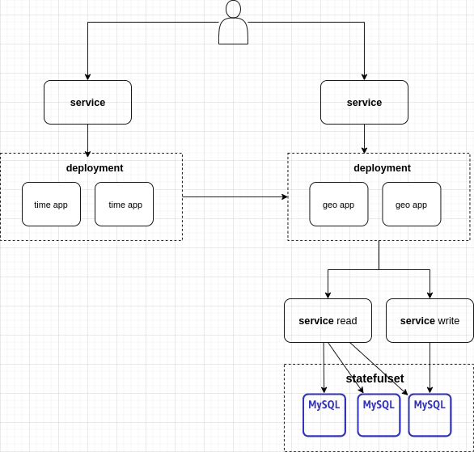

## Architecture diagram



## Folder structure
```
- geo: geo application code
- time: time application code
- kubernetes: kubernetes objects definition for entire architecture
- postman: postman collections and environments (useful for testing)
- test_mysql: kubernetes exposed mysql for local development
```

## Local development
### geo application env
```
cd geo
virtualenv -p python3.8 venv
source venv/bin/activate
pip -r requirements.txt
```
### time application env
```
cd time
virtualenv -p python3.8 venv
source venv/bin/activate
pip -r requirements.txt
```
### set up database
```
kubectl apply -f test_mysql/mysql.yml
minikube ip # ip address of minikube
kubectl describe service test-mysql-service # node port
```
- update KU_GEO_DB_HOST_READ, KU_GEO_DB_HOST_WRITE, KU_GEO_DB_HOST_PORT in Makefile to above values
- create database kube using mysql. apply sql scripts geo/db/*
### run apps
```
make run_time_server
make run_geo_server
```
- use console with proper env activated to run applications

## Minikube deployment
### build app images in minikube
```
make docker_build_time
make docker_build_geo
```
### create
```
make kubernetes_namespace_up
make kubernetes_db_up
make kubernetes_geo_up
make kubernetes_time_up
```
### destroy
```
make kubernetes_time_down
make kubernetes_geo_down
make kubernetes_db_down
make kubernetes_namespace_down
```
- while destroying db pvc can be left and command will hang. delete pvc in pgs-upskill manually and command will proceed
